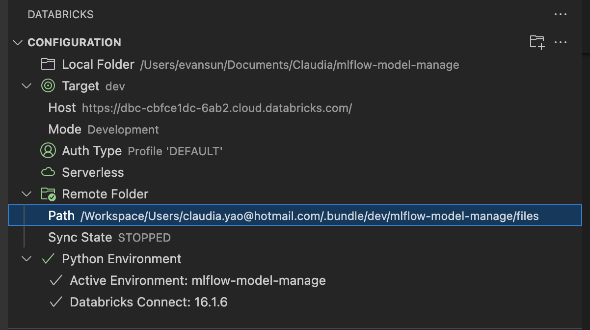

# Introduction

The repo contains a sample MLFlow project. It uses DataBricks Free Edition, and some functionalities could not work correctly

## Implemented functionalities:

1. Upload the initial dataset to DataBricks Unity Catalog.
2. Load existing data from Unity Catalog table.
3. Train/Evaluate model locally.
4. Log and register the model and its metrics/parameters to Unity Catalog.
5. Create a few unit test scripts.
6. Deploy the project to DataBricks.

## TBD: <br>

1. Automatically update the endpoint with the updated model

## Steps to run the project:

1. Git clone.<br>
2. Install Python 3.11<br>
3. Install Databricks CLI (new Go version):<br>

```bash
brew tap databricks/tap
brew install databricks

```

4. Activate virtual environment by `source .venv/bin/activate`
5. Run "uv sync"
6. Create DataBricks profile, install Databricks extension and configure it as below (refer to this video on how to configure https://www.youtube.com/watch?v=nEue_1THOvk&t=685s)
<br>

   

<br>
7. Open project_config_teen_addiction.yml

Catalog_name, schema_name needs to be set on DataBricks UI. If you use different name, please update the corresponding fields.
Experiment_name field should update the email address.

```bash
CATALOG_NAME: addiction_monitor_dev
SCHEMA_NAME: addiction_schema
TABLE_NAME: teen_phone_addiction
MODEL_NAME: teen_phone_addiction
ARTIFACT_NAME: teen_phone_addiction_predictor
ENDPOINT_NAME: teen-phone-addiction
EXPERIMENT_NAME: /Users/<your databricks login email>/teen_phone_addiction_experiment
ENV: development
```

8. Set project root folder as current working directory
9. Run `python3 src/data/upload_initial_data.py`
10. Run `python3 scripts/train_pipeline.py`
